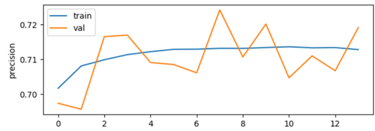
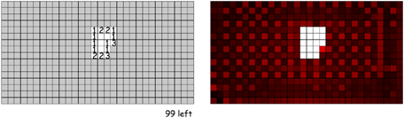
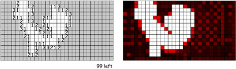

# Convolutional Neural Network To Assist Players in Minesweeper

The main objective of this project was to create an agent that sufficiently assists a player such that they can make the optimal move when no moves can be logically deduced. To do this, several sub-objectives are made. First, it was an objective that a square is automatically marked as a mine or a safe square in the heatmap if it can be guaranteed that the square is a mine or a safe square, respectively. Secondly, another objective was that the heatmap visualises the probability that each square is a mine. This is done so that players can know what move has the highest probability if they cannot further deduce that information logically. Achieving these two sub-objectives would result in the completion of the main objective of assisting a player to play Minesweeper.

## Data and Training

To train the model, data was randomly generated using functions to create boards in several different states. These states were of different complexities, with some being barely solved and others having many revealed squares and possible moves. Data was generated with random portions being uncovered to simulate random states/selections within an actual Minesweeper game. This was done so that the model had exposure to as many different scenarios as possible. A dataset of 100,000 boards was generated and used for the model. 

Data was single channel. In the future, multi-channel matrix input will be used to improve performance. One-hot encoding would be an example of a next step which would help the model recognize more patterns within the data.

## Model
The model consisted of 4 convolutional layers, the main layers having 3x3 kernels and making use of the sigmoid activation function.

```python
Conv2D(24, kernel_size=(3, 3), activation='sigmoid', padding='same'),
Conv2D(16, kernel_size=(3, 3), activation='sigmoid', padding='same'),
Conv2D(128, kernel_size=(3, 3), activation='sigmoid', padding='same'), 
Conv2D(1, kernel_size=(1, 1), activation='sigmoid', padding='same'),
```

This model proved to be optimal after hours of hyperparameter tuning. It can be noted that this model performed exceptionally well when experimenting with deeper neural networks. This is likely attributed to the lack of channels with the input.

## Quantitative Results

When evaluating the model, multiple performance measures were used. Accuracy was found to tell us a trivial amount of information regarding the problem. Precision ultimately was used as the main evaluation standard.



Precision peaked at around 75%. This number tells us how many of the models predictions were correct. This makes sense and is impressive given the model was provied thousands of examples with the board mostly covered.

## Qualitative Results

The model performed fairly well in detecting mines. Example runs on a few different board states can be seen below.





## Contributions

Model developed by Moez B. and Steven K.

## License

[MIT](https://choosealicense.com/licenses/mit/)